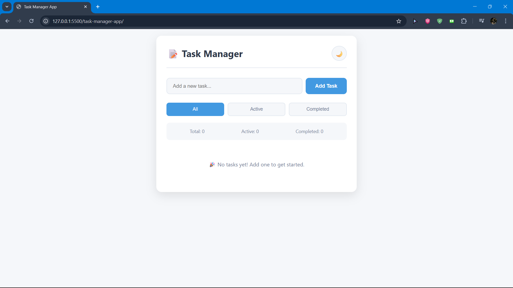
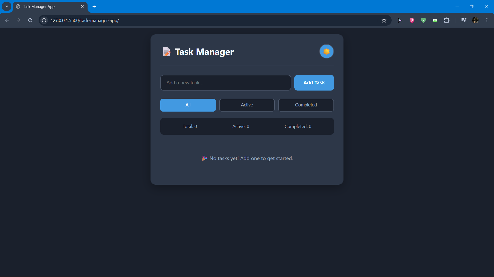

# Task Manager App

A simple and elegant task manager built with vanilla JavaScript.

## Features
- Add, edit, and delete tasks
- Mark tasks as complete
- Filter tasks by status
- Dark mode support
- Responsive design
- Data persistence with localStorage

## Tech Stack
- HTML5
- CSS3
- Vanilla JavaScript
- Local Storage API

## Installation
1. Clone the repository
2. Open index.html in your browser
3. Start managing your tasks!

## Screenshots

## Author
Lismala

## License
MIT
